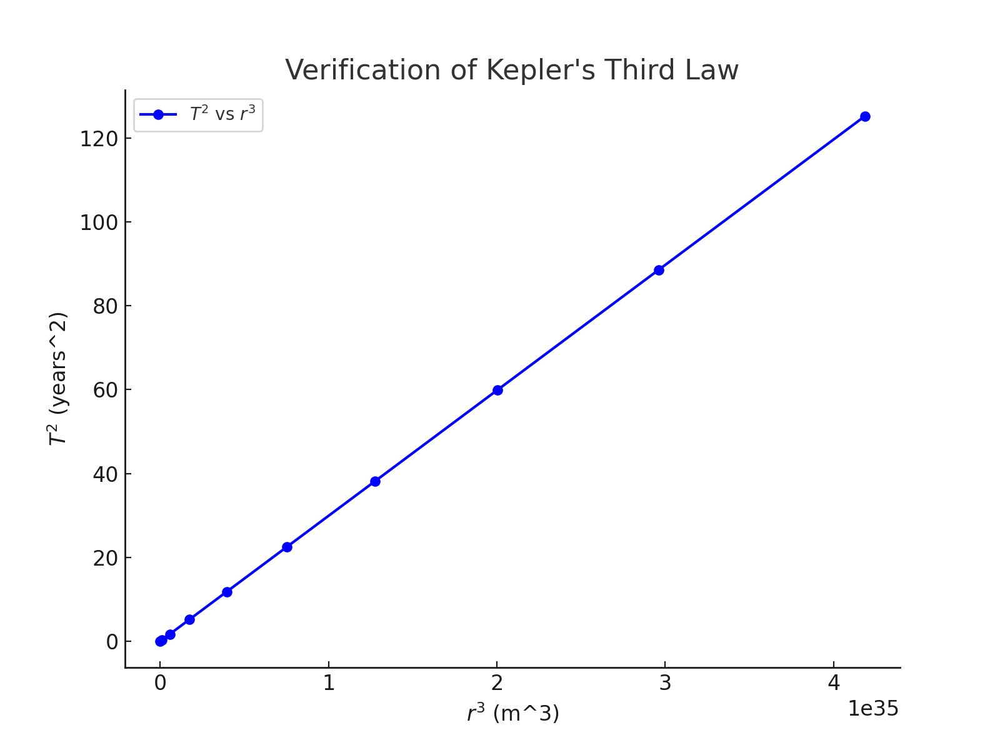
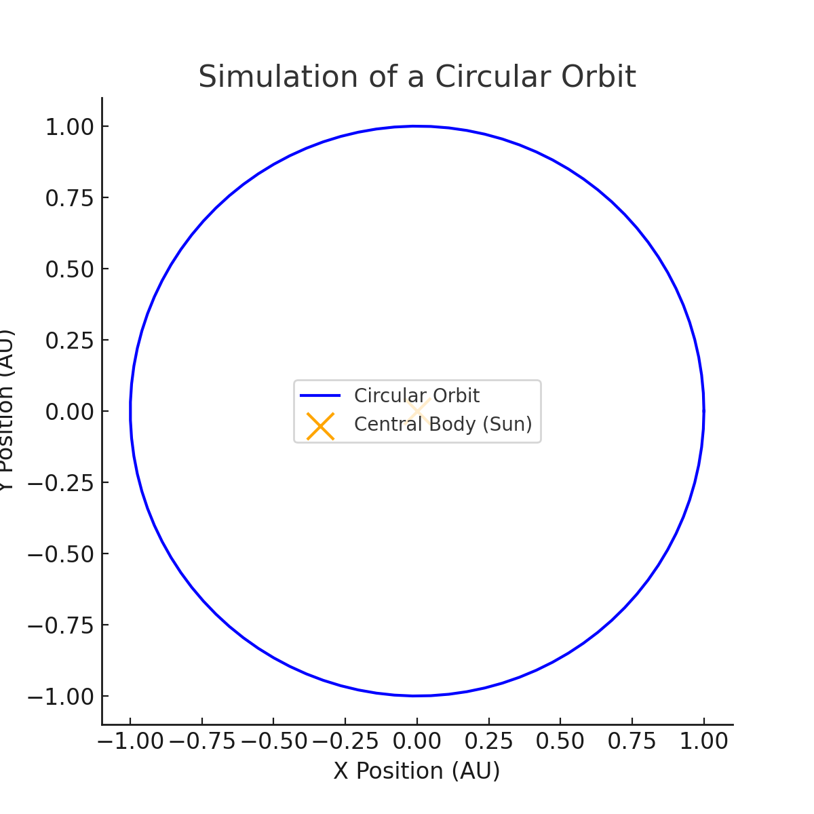

# Problem 1
# **Orbital Period and Orbital Radius**

## **Motivation**
Kepler's Third Law states that the square of the orbital period $$T$$ of a planet is proportional to the cube of the semi-major axis (orbital radius) $$r$$ of its orbit. Mathematically:

$$T^2 \propto r^3$$

This fundamental relationship allows us to:
- Predict planetary motions
- Calculate planetary masses and distances
- Understand gravitational interactions in celestial mechanics

---
## What is The Kepler Law
### Kepler's Laws of Planetary Motion
Johannes Kepler formulated three laws that describe the motion of planets around the Sun:

---

### 1. **Law of Ellipses**
Each planet moves in an **elliptical orbit** with the **Sun at one focus**.

An ellipse is mathematically represented by:

$$
\frac{x^2}{a^2} + \frac{y^2}{b^2} = 1
$$

Where:
- \( a \): semi-major axis
- \( b \): semi-minor axis

---

### 2. **Law of Equal Areas**
A line segment joining a planet and the Sun sweeps out **equal areas in equal times**.

This implies the planet moves **faster when closer** to the Sun and **slower when farther**.

Mathematically:

$$
\frac{dA}{dt} = \text{constant}
$$

Where:
- \( A \): area swept out
- \( t \): time

---

### 3. **Law of Harmonies**
The square of the orbital period \( T \) of a planet is **proportional to the cube** of the semi-major axis \( a \) of its orbit:

$$
T^2 \propto a^3
$$

Or for two planets orbiting the same star:

$$
\frac{T_1^2}{a_1^3} = \frac{T_2^2}{a_2^3}
$$

Where:
- \( T \): orbital period (in years)
- \( a \): semi-major axis (in astronomical units)

---
## **1. Derivation of the Relationship**
To derive Kepler's Third Law, we start with Newton’s Law of Gravitation:

$$F = \frac{GMm}{r^2}$$

where:
- $$G$$ is the gravitational constant,
- $$M$$ is the mass of the central body,
- $$m$$ is the mass of the orbiting object,
- $$r$$ is the orbital radius.

For circular orbits, the centripetal force is provided by gravity:

$$F = \frac{m v^2}{r}$$

Equating gravitational force to centripetal force:

$$\frac{GMm}{r^2} = \frac{m v^2}{r}$$

Canceling $$m$$ and rearranging:

$$v^2 = \frac{GM}{r}$$

The orbital period is given by:

$$T = \frac{2\pi r}{v}$$

Substituting $$v$$:

$$T = \frac{2\pi r}{\sqrt{GM/r}}$$

Squaring both sides:

$$T^2 = \frac{4\pi^2 r^3}{GM}$$

Thus, we arrive at Kepler's Third Law:

$$T^2 \propto r^3$$

---

## **2. Implications for Astronomy**
Kepler's Third Law is crucial in:
- Determining **planetary masses and distances** using observed orbital periods
- **Satellite and spacecraft navigation**
- Studying **exoplanetary systems**

### **Real-World Examples**
1. **Moon's Orbit Around Earth**:
   - Period: $$T_{moon} \approx 27.3$$ days
   - Radius: $$r_{moon} \approx 3.84 \times 10^5$$ km
2. **Planets in the Solar System**:
   - For Earth: $$T = 1$$ year, $$r = 1 AU$$
   - For Mars: $$T = 1.88$$ years, $$r = 1.52 AU$$ (follows $$T^2 \propto r^3$$)

---

## **3. Computational Simulation of Circular Orbits**
Below is a Python script that simulates circular orbits and verifies Kepler's Third Law:

```python
import numpy as np
import matplotlib.pyplot as plt
from scipy.constants import G

# Constants
M_sun = 1.989e30  # Mass of the Sun in kg
AU = 1.496e11  # 1 Astronomical Unit in meters

# Function to compute orbital period
def orbital_period(r, M):
    return 2 * np.pi * np.sqrt(r**3 / (G * M))

# Orbital radii in AU
radii_AU = np.linspace(0.1, 5, 10)
radii_m = radii_AU * AU

# Compute periods
periods = orbital_period(radii_m, M_sun) / (60 * 60 * 24 * 365)  # Convert to years

# Plot T^2 vs r^3
plt.figure(figsize=(8,6))
plt.plot(radii_m**3, periods**2, 'bo-', label='$T^2$ vs $r^3$')
plt.xlabel('$r^3$ (m^3)')
plt.ylabel('$T^2$ (years^2)')
plt.title('Verification of Kepler\'s Third Law')
plt.legend()
plt.grid()
plt.show()
```

---

## **4. Extension to Elliptical Orbits**
Kepler's Third Law also applies to **elliptical orbits**, where:

- $r$ is replaced by the **semi-major axis** $a$
- The relationship still holds: $$T^2 \propto a^3$$

This generalization allows for:
- Understanding **cometary orbits** (e.g., Halley's Comet)
- Studying **binary star systems**
- Determining **galactic dynamics**

---



## **Conclusion**
- **Kepler's Third Law** provides a direct link between orbital periods and radii.
- It helps **predict planetary motions and system dynamics**.
- **Computational models confirm** the theoretical relationship.
- The law extends to **elliptical orbits and cosmic scales**.

---

## **References**
1. Kepler, J. *Astronomia Nova* (1609)
2. Newton, I. *Principia Mathematica* (1687)
3. NASA Planetary Data
