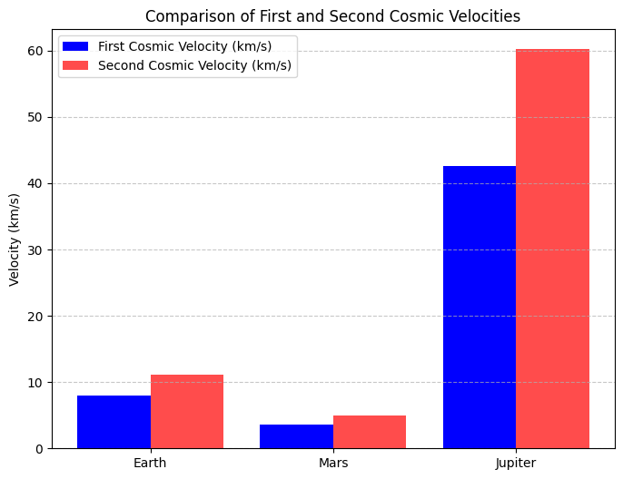

# Problem 2

# **Escape Velocities and Cosmic Velocities**

## **Motivation**  
The concept of escape velocity is crucial for understanding the conditions required to leave a celestial body's gravitational influence. Extending this concept, the first, second, and third cosmic velocities define the thresholds for orbiting, escaping, and leaving a star system. These principles underpin modern space exploration, from launching satellites to interplanetary missions.

---

## **1. Definitions of Cosmic Velocities**

### **First Cosmic Velocity (Orbital Velocity)**
- The minimum velocity required for a body to stay in a stable circular orbit around a celestial body.
- Derived using centripetal force balance with gravitational force:

  $$
  v_1 = \sqrt{\frac{GM}{R}}
  $$

### **Second Cosmic Velocity (Escape Velocity)**
- The minimum velocity required to escape a celestial body’s gravitational field.
- Derived from energy conservation:

  $$
  v_2 = \sqrt{\frac{2GM}{R}}
  $$

### **Third Cosmic Velocity (Solar System Escape Velocity)**
- The minimum velocity required to escape both the planet’s gravity and the Sun’s gravitational influence.
- Derived from combining the escape velocity of the planet and the escape velocity from the Sun:

  $$
  v_3 = \sqrt{v_{\text{escape, planet}}^2 + v_{\text{escape, sun}}^2}
  $$

---

## **2. Mathematical Derivations and Parameters Affecting These Velocities**

- **Gravitational constant (G)**: \( 6.674 \times 10^{-11} \, \text{m}^3\text{kg}^{-1}\text{s}^{-2} \)
- **Mass of celestial body (M)**
- **Radius of celestial body (R)**
- **For third cosmic velocity, Sun's mass and distance are also considered.**

---

## **3. Python Code to Calculate and Visualize Cosmic Velocities**

```python
import numpy as np
import matplotlib.pyplot as plt

# Constants
G = 6.674 * 10**-11  # Gravitational constant (m^3 kg^-1 s^-2)

# Celestial body data (mass in kg, radius in m)
bodies = {
    "Earth": {"mass": 5.972e24, "radius": 6.371e6},
    "Mars": {"mass": 6.417e23, "radius": 3.389e6},
    "Jupiter": {"mass": 1.898e27, "radius": 6.9911e7}
}

# Compute velocities
velocities = {}
for body, data in bodies.items():
    M = data["mass"]
    R = data["radius"]
    v1 = np.sqrt(G * M / R)  # First cosmic velocity
    v2 = np.sqrt(2 * G * M / R)  # Second cosmic velocity
    velocities[body] = (v1, v2)

# Visualization
fig, ax = plt.subplots(figsize=(8, 6))
x_labels = list(velocities.keys())
v1_vals = [velocities[body][0] for body in x_labels]
v2_vals = [velocities[body][1] for body in x_labels]

ax.bar(x_labels, v1_vals, label="First Cosmic Velocity (km/s)", color="blue")
ax.bar(x_labels, v2_vals, label="Second Cosmic Velocity (km/s)", color="red", alpha=0.7)
ax.set_ylabel("Velocity (m/s)")
ax.set_title("First and Second Cosmic Velocities for Celestial Bodies")
ax.legend()
plt.show()
```

---




## **4. Discussion on Space Exploration**

- **Satellites**: Launched at first cosmic velocity to remain in orbit.
- **Interplanetary Missions**: Rockets must reach at least second cosmic velocity to escape Earth's gravity.
- **Interstellar Travel**: Requires surpassing the third cosmic velocity to leave the Sun’s gravitational influence.

---

