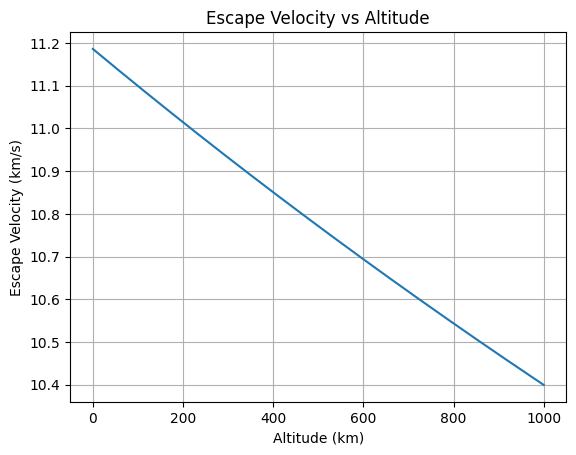

# Problem 3
# 🚀 Problem 3: Trajectories of a Freely Released Payload Near Earth

# 🚀 Trajectories of a Freely Released Payload Near Earth

Before diving into theory, explore how real spacecraft move using NASA’s official 3D simulation platform:

🌐 [NASA Eyes on the Solar System](https://eyes.nasa.gov/)

> Real-time orbits, mission tracking, and gravity interactions!

---

## 🎯 Motivation
...


## 🎯 Motivation

When a payload is released from a moving rocket near Earth, it may follow various trajectories depending on its initial velocity and position. This problem blends orbital mechanics and numerical simulations — essential for tasks like satellite deployment, reentry, and interplanetary missions.

---

## 🌍 Governing Physics

To better understand gravitational attraction and orbital motion, you can explore this interactive simulation:

🌐 [PhET: Gravity and Orbits](https://phet.colorado.edu/en/simulation/gravity-and-orbits)

> Visualize how mass, distance, and velocity affect planetary orbits and satellite motion in real time!


### Newton's Law of Gravitation

The gravitational force on the payload is:

$$
\vec{F} = - \frac{GMm}{r^2} \hat{r}
$$

- \( G = 6.674 \times 10^{-11} \, \text{m}^3/\text{kg s}^2 \)
- \( M = 5.972 \times 10^{24} \, \text{kg} \) (Earth's mass)
- \( m \): Payload mass (cancels out in acceleration)
- \( r \): Distance from Earth's center

Using Newton's Second Law:

$$
\vec{a} = \frac{\vec{F}}{m} = - \frac{GM}{r^2} \hat{r}
$$

---

## 🌌 Orbital Energy and Trajectories

Total specific mechanical energy of the payload:

$$
\epsilon = \frac{v^2}{2} - \frac{GM}{r}
$$

- \( \epsilon < 0 \): Elliptical orbit (bound)
- \( \epsilon = 0 \): Parabolic trajectory (escape)
- \( \epsilon > 0 \): Hyperbolic trajectory (escape)

Escape velocity at distance \( r \):

$$
v_{\text{esc}} = \sqrt{\frac{2GM}{r}}
$$

Escape velocity decreases with altitude since gravitational pull weakens. It is given by:

$$
v_{\text{esc}} = \sqrt{\frac{2GM}{r}}
$$

Below is a plot showing how escape velocity changes with altitude:



## 🧮 Numerical Simulation (Euler Method)

We simulate the payload motion using small time steps.

### Assumptions:
- 2D motion (x, y)
- Only gravitational force from Earth
- Earth is a point mass at the origin

---

## 📦 Python Implementation

```python
import numpy as np
import matplotlib.pyplot as plt

# Constants
G = 6.67430e-11        # gravitational constant [m^3/kg/s^2]
M = 5.972e24           # Earth mass [kg]
R_earth = 6.371e6      # Earth radius [m]

# Initial conditions
altitude = 300e3                   # 300 km altitude
r0 = R_earth + altitude
v0 = 7500                          # initial speed [m/s] (tune this)
theta = np.radians(0)             # angle w.r.t. horizontal

# Position and velocity vectors
x = [r0]
y = [0]
vx = [0]
vy = [v0]

# Time settings
dt = 1                             # time step [s]
t_max = 8000
N = int(t_max / dt)

# Simulation loop
for i in range(N):
    r = np.sqrt(x[-1]**2 + y[-1]**2)
    ax = -G * M * x[-1] / r**3
    ay = -G * M * y[-1] / r**3

    vx_new = vx[-1] + ax * dt
    vy_new = vy[-1] + ay * dt

    x_new = x[-1] + vx_new * dt
    y_new = y[-1] + vy_new * dt

    # Stop if it hits Earth
    if np.sqrt(x_new**2 + y_new**2) <= R_earth:
        break

    vx.append(vx_new)
    vy.append(vy_new)
    x.append(x_new)
    y.append(y_new)

# Plotting
plt.figure(figsize=(8,8))
earth = plt.Circle((0, 0), R_earth, color='blue', alpha=0.3, label='Earth')
plt.gca().add_patch(earth)

plt.plot(x, y, label='Payload Trajectory')
plt.xlabel('x [m]')
plt.ylabel('y [m]')
plt.title('Payload Trajectory Near Earth')
plt.axis('equal')
plt.grid(True)
plt.legend()
plt.show()

---

## 🔍 Explore Further: Beyond Earth

While this project focuses on payloads near Earth, it's also valuable to understand more complex gravitational dynamics.

🎥 **SkyMarvels™ – Solar System Barycenter**  
How the Sun moves due to gravitational pulls from the planets — visualized with Celestia.

[](https://www.youtube.com/watch?v=1iSR3Yw6FXo)

> Barycenters explain why the Sun itself moves slightly — important for understanding motion in multi-body systems.
