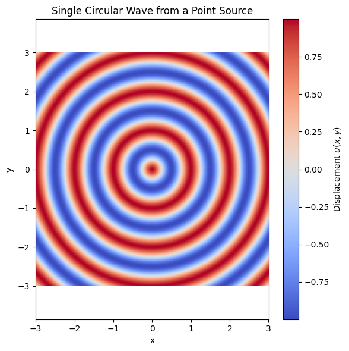
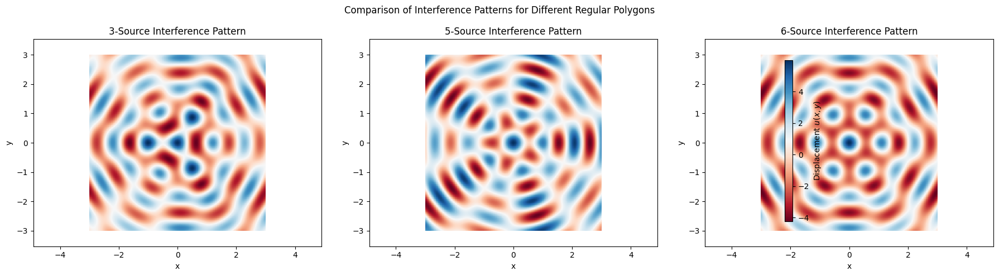

# Problem 1
# Interference Patterns on a Water Surface

## Motivation

Interference occurs when waves from multiple sources overlap in space, creating new wave patterns. On a water surface, this is easily observed when circular ripples from different points intersect, producing **interference patterns**.

These patterns reveal:

- **Constructive interference**: where waves reinforce each other
- **Destructive interference**: where waves cancel each other

Studying such patterns helps us understand:

- Superposition principle
- Phase relationships between waves
- Real-world wave interactions

---

## Problem Statement

We aim to simulate and analyze the **interference pattern** created by **circular waves** emitted from **coherent point sources** located at the **vertices of a regular polygon**.

---

## Theoretical Background

### Single Circular Wave

The disturbance caused by a single point source at position \( (x_0, y_0) \) on the water surface is modeled by:

$$
u(x, y, t) = A \cdot \cos(kr - \omega t + \phi)
$$

Where:

- \( u(x, y, t) \): Displacement at position \( (x, y) \) and time \( t \)
- \( A \): Amplitude
- \( k = \frac{2\pi}{\lambda} \): Wave number
- \( \lambda \): Wavelength
- \( \omega = 2\pi f \): Angular frequency
- \( f \): Frequency
- \( r = \sqrt{(x - x_0)^2 + (y - y_0)^2} \): Distance from source to point
- \( \phi \): Initial phase


---

### Superposition of Waves

If there are \( N \) identical, coherent wave sources, the total displacement at any point \( (x, y) \) is:

$$
u_{\text{total}}(x, y, t) = \sum_{i=1}^{N} A \cdot \cos(k r_i - \omega t + \phi)
$$

Where:

- \( r_i = \sqrt{(x - x_i)^2 + (y - y_i)^2} \): Distance from the \( i^\text{th} \) source to point \( (x, y) \)

---

## Simulation: Square Configuration (4 Sources)

We simulate 4 point sources placed at the vertices of a **square**, centered at the origin.

### Simulation Parameters

- Polygon type: Square (4 vertices)
- Radius \( R = 1 \)
- Amplitude \( A = 1 \)
- Wavelength \( \lambda = 1 \)
- Frequency \( f = 1 \)
- Phase \( \phi = 0 \)
- Time snapshot \( t = 0 \)

---

##  Python Code

The following Python script simulates the interference pattern produced by **four coherent wave sources** placed at the vertices of a **square**, centered at the origin. Each source emits circular waves with the same amplitude, wavelength, and frequency.

The wave equation used for each point source is:

$$
u(x, y, t) = A \cdot \cos(k r - \omega t + \phi)
$$

The total displacement is calculated by the superposition of waves from all sources:

$$
u_{\text{total}}(x, y, t) = \sum_{i=1}^{N} A \cdot \cos(k r_i - \omega t + \phi)
$$

Here’s the full Python implementation:

```python
import numpy as np
import matplotlib.pyplot as plt

# Wave parameters
A = 1
wavelength = 1
frequency = 1
k = 2 * np.pi / wavelength
omega = 2 * np.pi * frequency
phi = 0
t = 0  # single time snapshot

# Grid setup
x = np.linspace(-3, 3, 500)
y = np.linspace(-3, 3, 500)
X, Y = np.meshgrid(x, y)

# Square: 4 vertices on a circle
N = 4
R = 1
angles = np.linspace(0, 2*np.pi, N, endpoint=False)
sources = [(R * np.cos(a), R * np.sin(a)) for a in angles]

# Superposition of waves
Z = np.zeros_like(X)
for (x0, y0) in sources:
    r = np.sqrt((X - x0)**2 + (Y - y0)**2)
    Z += A * np.cos(k * r - omega * t + phi)

# Plotting
plt.figure(figsize=(8, 6))
plt.pcolormesh(X, Y, Z, shading='auto', cmap='RdBu')
plt.colorbar(label='Water Surface Displacement $u(x, y)$')
plt.scatter(*zip(*sources), color='black', marker='o', label='Sources')
plt.title('Interference Pattern from 4 Point Sources (Square Configuration)')
plt.xlabel('x')
plt.ylabel('y')
plt.legend()
plt.axis('equal')
plt.tight_layout()
plt.show()
```


[def]: Unknown.png

# Extensions 

(Link to Google Collab Simulation)https://colab.research.google.com/drive/1MZGHTR9STk3OZIWyuUVt4DeySR8lZ-JC?authuser=0