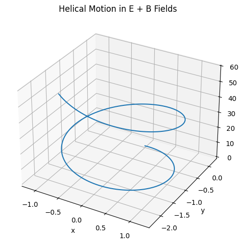
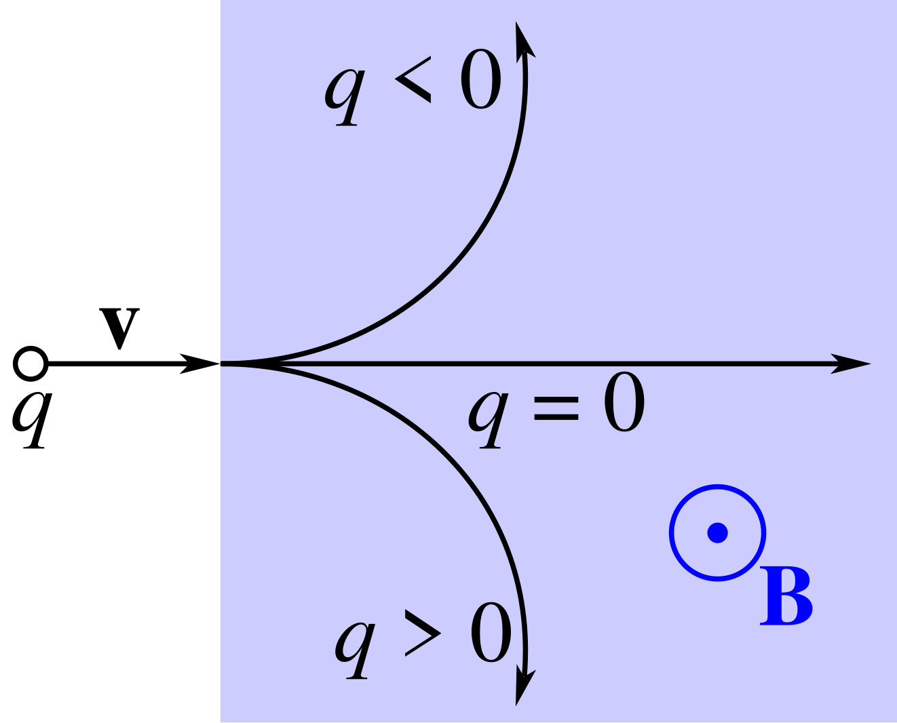
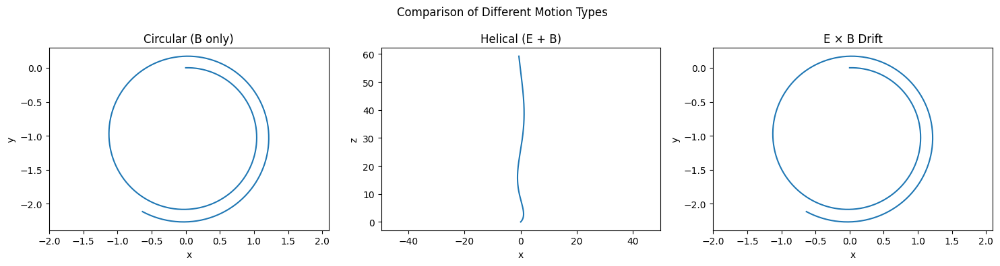

# Problem 1
# Simulating the Effects of the Lorentz Force

##  Motivation

The **Lorentz force** is a fundamental concept in electromagnetism and charged particle dynamics. It describes how a charged particle moves under the influence of electric and magnetic fields. The force is given by:

$$
\vec{F} = q (\vec{E} + \vec{v} \times \vec{B})
$$

Where:

- \( \vec{F} \) is the total force on the particle  
- \( q \) is the charge  
- \( \vec{E} \) is the electric field  
- \( \vec{v} \) is the velocity of the particle  
- \( \vec{B} \) is the magnetic field

The Lorentz force governs the motion of charged particles in a variety of physical systems, including:

- Particle accelerators (e.g., cyclotrons, synchrotrons)  
- Mass spectrometers  
- Plasma confinement in fusion devices (e.g., tokamaks)  
- Astrophysical environments (e.g., solar wind, magnetospheres)

---

##  Applications of the Lorentz Force

1. **Particle Accelerators**  
   Charged particles are steered and accelerated using magnetic and electric fields based on Lorentz force dynamics.

2. **Mass Spectrometers**  
   Particles with different mass-to-charge ratios follow different curved paths in a magnetic field, enabling identification.

3. **Plasma Confinement**  
   Magnetic fields are used to confine hot plasmas in devices like **tokamaks**, where charged particles spiral and drift in controlled ways.

---

##  Theory and Equations of Motion

The motion of a charged particle under Lorentz force follows Newton's second law:

$$
m \frac{d\vec{v}}{dt} = q (\vec{E} + \vec{v} \times \vec{B})
$$

This is a system of coupled differential equations that can be solved numerically using methods like **Euler's method** or **Runge-Kutta**.

---

## Python Simulation: Lorentz Force

We simulate three cases:

1. Uniform Magnetic Field (Only \( \vec{B} \))  
2. Combined Uniform Electric and Magnetic Fields  
3. Crossed \( \vec{E} \perp \vec{B} \) Fields

###  Parameters:

- Charge \( q = 1 \) C  
- Mass \( m = 1 \) kg  
- Initial velocity \( \vec{v}_0 = (v_x, v_y, v_z) \)  
- Fields:  
  \( \vec{B} = (0, 0, B_z) \)  
  \( \vec{E} = (E_x, 0, 0) \)

---

###  Euler Integration Function

```python
import numpy as np
import matplotlib.pyplot as plt
from mpl_toolkits.mplot3d import Axes3D

def lorentz_force(q, m, E, B, v0, r0, dt, steps):
    r = np.zeros((steps, 3))
    v = np.zeros((steps, 3))
    r[0] = r0
    v[0] = v0
    
    for i in range(steps - 1):
        F = q * (E + np.cross(v[i], B))
        a = F / m
        v[i + 1] = v[i] + a * dt
        r[i + 1] = r[i] + v[i] * dt
    return r, v

```


###  Interactive Lorentz Force Simulations

Explore these online tools to interactively understand the Lorentz force:

- [PhET: Charges and Fields](https://phet.colorado.edu/en/simulation/charges-and-fields)
- [Falstad: Magnetic Field Force Simulator](http://www.falstad.com/mathphysics.html)
- [MyPhysicsLab: Lorentz Force](https://www.myphysicslab.com/electric-charges/electric-magnetic-deflection-en.html)

These visual tools can help you explore the vector nature of force, circular motion in B-fields, and drift dynamics in crossed fields.

