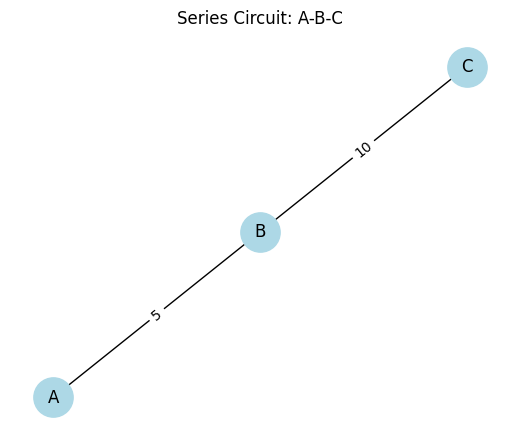
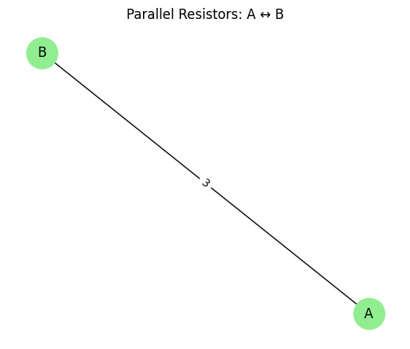
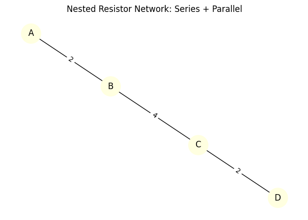

# Problem 1
#  Equivalent Resistance Using Graph Theory

---

## Motivation

Calculating **equivalent resistance** is a fundamental problem in analyzing electrical circuits. While it's easy to reduce simple circuits using series and parallel rules, this becomes extremely difficult for large or nested resistor networks.

Graph theory offers a powerful, systematic approach for simplifying electrical circuits. In this approach:

- Nodes represent **junctions**
- Edges represent **resistors**, with edge weights as resistance values

This allows for **automated reduction** and enables complex real-world applications such as:

- Electrical network simulation
- Optimization of energy efficiency
- Real-time fault diagnosis
- Integration into circuit design software

---

## Theoretical Framework

We represent a circuit as an **undirected graph**:

- Each **edge** is a resistor with resistance \( R \in \mathbb{R}^+ \)
- Each **node** is a junction or connection point

To simplify the circuit, we use:

### Series Rule

If a node has degree 2 (i.e. connected to only two other nodes), and it's not a terminal node, then the resistors connected to it are in series:

$$
R_{\text{eq}} = R_1 + R_2
$$

### Parallel Rule

If two or more resistors connect the **same pair of nodes**, they are in parallel:

$$
\frac{1}{R_{\text{eq}}} = \sum_{i=1}^n \frac{1}{R_i}
$$

---

## Graph Simplification Algorithm

We reduce the graph step by step:

1. Identify nodes of degree 2 and combine adjacent edges using the **series rule**
2. Detect parallel edges between the same nodes and combine them using the **parallel rule**
3. Repeat until the graph contains a single edge between the source and the target node

---

## Python Implementation (Task 2)

Below is the full Python implementation using `networkx` for graph modeling and `matplotlib` for visualization.

```python
import networkx as nx
import matplotlib.pyplot as plt

def draw_graph(G, title="Circuit Graph"):
    pos = nx.spring_layout(G)
    edge_labels = nx.get_edge_attributes(G, 'resistance')
    nx.draw(G, pos, with_labels=True, node_color='lightblue', node_size=1000)
    nx.draw_networkx_edge_labels(G, pos, edge_labels=edge_labels)
    plt.title(title)
    plt.show()

def simplify_circuit(G):
    changed = True
    while changed:
        changed = False

        # Series reduction
        for node in list(G.nodes):
            if G.degree[node] == 2 and len(G.nodes) > 2:
                neighbors = list(G.neighbors(node))
                if len(neighbors) == 2:
                    r1 = G[node][neighbors[0]]['resistance']
                    r2 = G[node][neighbors[1]]['resistance']
                    req = r1 + r2
                    G.add_edge(neighbors[0], neighbors[1], resistance=req)
                    G.remove_node(node)
                    changed = True
                    break

        # Parallel reduction
        to_merge = {}
        for u, v, data in G.edges(data=True):
            key = tuple(sorted((u, v)))
            if key in to_merge:
                to_merge[key].append(data['resistance'])
            else:
                to_merge[key] = [data['resistance']]

        for (u, v), resistors in to_merge.items():
            if len(resistors) > 1:
                inv_total = sum(1 / r for r in resistors)
                req = 1 / inv_total if inv_total != 0 else float('inf')
                G.remove_edges_from([(u, v)] * len(resistors))
                G.add_edge(u, v, resistance=req)
                changed = True
                break

    return G

def equivalent_resistance(G, source, target):
    if G.has_edge(source, target):
        return G[source][target]['resistance']
    return float('inf')
```
## Examples & Results

### Example 1: Simple Series
```python
G1 = nx.Graph()
G1.add_edge('A', 'B', resistance=5)
G1.add_edge('B', 'C', resistance=10)

draw_graph(G1, "Before: Series Combination")
simplified_G1 = simplify_circuit(G1)
draw_graph(simplified_G1, "After: Series Reduced")
print("Equivalent Resistance (A–C):", equivalent_resistance(simplified_G1, 'A', 'C'), "Ω")

```



## Series Circuit: A-B-C

This is a **series circuit** with three nodes: **A**, **B**, and **C**. The connections and resistances between nodes are as follows:

- From **A** to **B**: resistance \( R_{AB} = 5 \, \Omega \)
- From **B** to **C**: resistance \( R_{BC} = 10 \, \Omega \)

The total resistance \( R_{total} \) in a series circuit is calculated as:

$$
R_{total} = R_{AB} + R_{BC} = 5 \, \Omega + 10 \, \Omega = 15 \, \Omega
$$

### Characteristics of a Series Circuit

- The **same current** flows through all components.
- The **total resistance** is the sum of all resistances.
- The **voltage** is divided based on each component's resistance.


### Example 2: Simple Parallel
```python
G2 = nx.MultiGraph()
G2.add_edge('A', 'B', resistance=6)
G2.add_edge('A', 'B', resistance=3)
G2 = nx.Graph(G2)

draw_graph(G2, "Before: Parallel Combination")
simplified_G2 = simplify_circuit(G2)
draw_graph(simplified_G2, "After: Parallel Reduced")
print("Equivalent Resistance (A–B):", equivalent_resistance(simplified_G2, 'A', 'B'), "Ω")

```


## Parallel Resistors: A ↔ B

This is a **parallel circuit** with multiple resistors connecting node **A** to node **B**. Each branch has a resistance of:

- \( R = 3 \, \Omega \)

If there are \( n \) such resistors in parallel, the total resistance \( R_{total} \) is calculated using the formula:

$$
\frac{1}{R_{total}} = \sum_{i=1}^{n} \frac{1}{R_i}
$$

For example, with two resistors of \( 3 \, \Omega \) in parallel:

$$
\frac{1}{R_{total}} = \frac{1}{3} + \frac{1}{3} = \frac{2}{3} \quad \Rightarrow \quad R_{total} = \frac{3}{2} = 1.5 \, \Omega
$$

### Key Properties of Parallel Circuits:

- **Voltage** is the same across all branches.
- **Total resistance** decreases with more branches.
- **Current** divides among the paths based on resistance values.


### Example 3: Nested Combination
```python
G3 = nx.MultiGraph()
G3.add_edge('A', 'B', resistance=2)
G3.add_edge('B', 'C', resistance=4)
G3.add_edge('B', 'C', resistance=4)
G3.add_edge('C', 'D', resistance=2)
G3 = nx.Graph(G3)

draw_graph(G3, "Before: Nested Circuit")
simplified_G3 = simplify_circuit(G3)
draw_graph(simplified_G3, "After: Nested Reduced")
print("Equivalent Resistance (A–D):", equivalent_resistance(simplified_G3, 'A', 'D'), "Ω")
```


## Nested Resistor Network: Series + Parallel

This network consists of resistors between nodes:

- \( R_{AB} = 2\, \Omega \)
- \( R_{BC} = 4\, \Omega \)
- \( R_{CD} = 2\, \Omega \)

Assuming a **series connection**, the total resistance is:

$$
R_{total} = R_{AB} + R_{BC} + R_{CD} = 2 + 4 + 2 = 8 \, \Omega
$$

### Key Series Circuit Properties:

- **Same current** through all resistors
- **Total resistance** is the sum
- **Voltage divides** among resistors

### If Node C had a parallel branch:

Suppose another resistor \( R_{CE} \) (e.g., \( 4\, \Omega \)) connected to a new node, E. Then C would form a junction, creating a **parallel segment**, and you'd calculate it like:

$$
\frac{1}{R_{parallel}} = \frac{1}{R_{CD}} + \frac{1}{R_{CE}}
$$

Then plug that back into the total series path.


## Additional Interactive Resources
These tools allow you to build, explore, and analyze resistor circuits beyond theoretical models:

- [Tinkercad Circuits](https://www.tinkercad.com/circuits)
- [Wolfram: Equivalent Resistance Explorer](https://demonstrations.wolfram.com/EquivalentResistanceInResistorNetworks/)
- [DCACLab Circuit Builder](https://dcaclab.com/)
