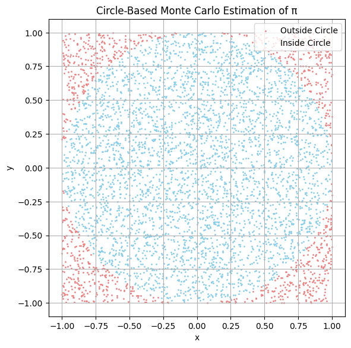
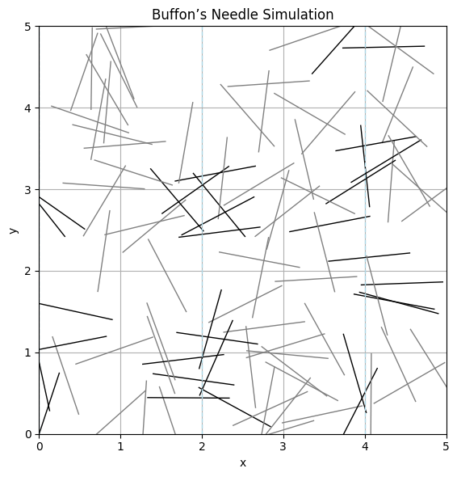

# Problem 2
# Estimating \( \pi \) Using Monte Carlo Methods

---

## Motivation

The number \( \pi \) is one of the most important constants in mathematics, appearing in geometry, calculus, physics, engineering, and probability. While it is typically calculated using analytical or series methods, it can also be **estimated using randomness** via **Monte Carlo simulations**.

Monte Carlo methods use repeated random sampling to obtain numerical estimates. One particularly elegant application is the estimation of \( \pi \) through:

- **Geometric probability**: simulating random points inside a square and counting how many fall within an inscribed circle.
- **Buffon’s Needle**: a probability problem from the 18th century involving the likelihood that a needle crosses lines on a floor.

These approaches demonstrate how randomness can approximate precise mathematical values and give us insights into convergence, error, and simulation design.

---

## Part 1: Estimating \( \pi \) Using a Circle

### Theoretical Foundation

Imagine a unit circle (radius \( r = 1 \)) inscribed within a square of side length 2 (from \(-1\) to \(1\) along both axes).

The area of the square is:
$$
A_{\text{square}} = (2r)^2 = 4
$$

The area of the circle is:
$$
A_{\text{circle}} = \pi r^2 = \pi
$$

The ratio of the circle's area to the square’s area is:
$$
\frac{A_{\text{circle}}}{A_{\text{square}}} = \frac{\pi}{4}
$$

So, if we generate random points uniformly in the square and count the fraction that fall inside the circle (i.e., satisfy \( x^2 + y^2 \leq 1 \)), we can estimate \( \pi \) by:

$$
\pi \approx 4 \cdot \frac{\text{Points in Circle}}{\text{Total Points}}
$$

---

### Simulation Steps

1. Generate \( N \) random points in the square \([-1, 1] \times [-1, 1]\)
2. Count how many fall inside the unit circle
3. Apply the formula above to estimate \( \pi \)

---
### What is The Monte Carlo Method

The **Monte Carlo method** is a numerical approach that uses **random sampling** to solve mathematical problems that may be deterministic or probabilistic in nature.

---

##  Basic Principle

To estimate a quantity \( Q \), perform many random experiments and take the average result:

$$
Q \approx \frac{1}{N} \sum_{i=1}^{N} f(x_i)
$$

Where:
- \( N \): number of random samples
- \( x_i \): randomly sampled inputs
- \( f(x_i) \): the function evaluated at \( x_i \)

---

## Example: Estimating \( \pi \)

1. Generate \( N \) random points in the unit square \([0, 1] \times [0, 1]\)
2. Count how many fall inside the quarter-circle of radius 1:

$$
\text{if } x^2 + y^2 \leq 1 \text{, it's inside}
$$

3. Then approximate \( \pi \) as:

$$
\pi \approx 4 \cdot \frac{\text{Number of points inside circle}}{N}
$$

---

##  Applications

- **Physics**: Particle transport, statistical mechanics
- **Finance**: Option pricing, risk analysis
- **Engineering**: Reliability simulations
- **Mathematics**: Multidimensional integrals

---

## Key Advantages

- Handles high-dimensional problems
- Easy to implement
- Scales well with computational power

---

## Limitations

- Convergence is slow (\( \propto \frac{1}{\sqrt{N}} \))
- Needs a large number of samples for high accuracy
---
### Visualization

We can visualize this method by plotting:
- Points inside the circle (where \( x^2 + y^2 \leq 1 \))
- Points outside the circle but within the square

---

### Convergence Analysis

By increasing the number of points, we should observe:
- The estimate converges closer to the true value of \( \pi \)
- The variance of estimates decreases

Theoretically, the **standard error** of this method decreases as:

$$
\text{Error} \propto \frac{1}{\sqrt{N}}
$$

## Part 2: Estimating \( \pi \) Using Buffon’s Needle

### Theoretical Foundation

Buffon’s Needle is a classical probability problem:
- Drop a needle of length \( L \) onto a plane with **equally spaced horizontal lines** \( d \) units apart (with \( L \leq d \)).
- The probability \( P \) that the needle **crosses a line** is:

$$
P = \frac{2L}{\pi d}
$$

From this, we can estimate \( \pi \) using:

$$
\pi \approx \frac{2L \cdot N}{d \cdot C}
$$

Where:
- \( N \) is the number of needle drops
- \( C \) is the number of times the needle crosses a line

---

### Simulation Steps

1. Simulate random needle drops:
   - Randomly choose the needle center position
   - Randomly choose its angle
2. Count how many needles **cross a line**
3. Estimate \( \pi \) using the formula above

---
##### Buffon's Needle Method

**Buffon’s Needle** is a probabilistic method for estimating \( \pi \) by simulating needle drops onto a surface with parallel lines.

---

## Setup

- Needle length: \( L \)
- Distance between lines: \( D \)
- \( L \leq D \)
- Drop the needle \( N \) times

Let \( H \) be the number of times the needle **crosses** a line.

---

## Theoretical Probability

The probability that a needle crosses a line is:

$$
P = \frac{2L}{\pi D}
$$

---

## Estimating \( \pi \)

By observing the experimental crossing rate:

$$
\pi \approx \frac{2L \cdot N}{D \cdot H}
$$

Where:
- \( N \): number of total trials
- \( H \): number of hits (crossings)

---

## Application

This method is a classic **Monte Carlo simulation** that uses **geometric probability** to estimate π. It’s also a great demonstration of how randomness can solve complex mathematical problems.

---
### Visualization

In a graphical simulation, we can show:
- Needles as line segments
- Horizontal lines they may cross
- Highlight needles that cross the lines

This provides an intuitive understanding of the randomness and geometry involved.

---

### Convergence Behavior

Buffon’s Needle converges more slowly than the circle method because:
- The crossing condition is more specific and less frequently triggered
- Variance in estimation is higher

It still demonstrates the power of geometric probability in estimating \( \pi \).

---

## Comparison of Methods

| Method            | Formula                                  | Speed      | Accuracy   | Visualization |
|-------------------|------------------------------------------|------------|------------|---------------|
| Circle Monte Carlo| \( \pi \approx 4 \cdot \frac{\text{Inside}}{\text{Total}} \) | Fast       | Good       | 2D scatter plot |
| Buffon’s Needle   | \( \pi \approx \frac{2L \cdot N}{d \cdot C} \) | Slower     | Noisier    | Needle over lines |

---

## Key Insights

- Both methods rely on **random sampling** and **geometry**.
- Increasing the number of trials improves the accuracy.
- Monte Carlo methods offer **visual and intuitive** ways to estimate mathematical constants.
- These ideas generalize to simulate **complex systems in physics, biology, finance, and beyond**.

---

## Extensions

- Try using **different values of \( L \) and \( d \)** in Buffon’s Needle
- Estimate **convergence rates** numerically by plotting error vs. sample size
- Animate the simulation process to show convergence dynamically
- Use **parallel computing** to increase the number of trials

---

## Related Simulations (Interactive Tools)

- [Visualize Monte Carlo Estimation of Pi – Seeing Theory](https://seeing-theory.brown.edu/probability-distributions/index.html#section3)
- [Desmos – Pi Approximation (Monte Carlo)](https://www.desmos.com/calculator/f5x4eduu5m)

These tools help build intuition and reinforce the geometric probability interpretation of \( \pi \).

---
