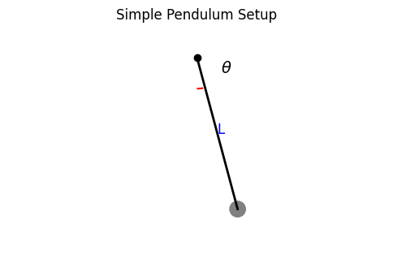
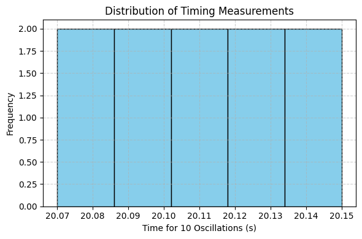

#  Problem 1: Measuring Gravitational Acceleration with a Pendulum

##  Objective

The goal of this experiment is to determine the local gravitational acceleration \( g \) using a simple pendulum and to perform a detailed uncertainty analysis. This exercise emphasizes the importance of precision in measurements and the treatment of experimental uncertainties.

---

##  Materials

| Item             | Description                                 |
|------------------|---------------------------------------------|
| String           | 1.000 meters long                           |
| Weight           | A small, dense object (e.g., keychain)      |
| Stopwatch        | Smartphone timer, resolution ±0.01 s        |
| Ruler/Tape       | 1 mm resolution, uncertainty ±0.005 m       |

---

## Experimental Setup

- The pendulum was constructed by attaching a small mass to one end of the string and fixing the other end to a stable support.
- The length of the pendulum \( L \) was measured from the pivot to the center of mass of the weight.
- The angular displacement was kept under 15° to satisfy the small angle approximation.

\[
L = 1.000 \, \text{m}, \quad u_L = \pm 0.005 \, \text{m}
\]

---

##  Data Collection

The time for 10 complete oscillations was measured and recorded 10 times:

| Trial | \( t_{10} \) (s) |
|--------|------------------|
| 1      | 20.12            |
| 2      | 20.09            |
| 3      | 20.15            |
| 4      | 20.08            |
| 5      | 20.11            |
| 6      | 20.13            |
| 7      | 20.10            |
| 8      | 20.14            |
| 9      | 20.07            |
| 10     | 20.11            |

---

## Calculations

### 1. Mean Time and Standard Deviation

\[
\bar{t}_{10} = \frac{1}{10} \sum t_{10} = \frac{201.10}{10} = 20.110 \, \text{s}
\]

\[
s = \sqrt{\frac{\sum (t_i - \bar{t})^2}{n-1}} \approx 0.025 \, \text{s}
\]

\[
u_{\bar{t}} = \frac{s}{\sqrt{n}} = \frac{0.025}{\sqrt{10}} \approx 0.0079 \, \text{s}
\]

### 2. Period of One Oscillation

\[
T = \frac{\bar{t}_{10}}{10} = \frac{20.110}{10} = 2.011 \, \text{s}
\]

\[
u_T = \frac{u_{\bar{t}}}{10} = 0.00079 \, \text{s}
\]

### 3. Gravitational Acceleration Calculation

Using the formula:

\[
g = \frac{4\pi^2 L}{T^2}
\]

\[
g = \frac{4\pi^2 \cdot 1.000}{(2.011)^2} = \frac{39.478}{4.0441} \approx 9.77 \, \text{m/s}^2
\]

---

##  Uncertainty Propagation

Using the propagation formula:

\[
\left( \frac{u_g}{g} \right)^2 = \left( \frac{u_L}{L} \right)^2 + \left( 2 \cdot \frac{u_T}{T} \right)^2
\]

\[
= (0.005)^2 + \left(2 \cdot \frac{0.00079}{2.011}\right)^2 \approx 0.000025 + 0.00000061
\]

\[
\frac{u_g}{g} = \sqrt{0.00002561} \approx 0.00506
\]

\[
u_g = g \cdot 0.00506 = 9.77 \cdot 0.00506 \approx 0.049 \, \text{m/s}^2
\]

---
, which falls within the uncertainty range.

---

## Analysis and Discussion

###  Sources of Uncertainty

- **Length Measurement**: The ruler’s resolution of ±0.005 m affects the accuracy of \( L \), which directly influences \( g \).
- **Time Measurement**: Manual stopwatch operation introduces human reaction error. Averaging multiple trials reduces this impact.
- **Oscillation Counting**: Measuring 10 full cycles helps minimize timing errors by reducing the relative effect of individual reaction time.

### Experimental Assumptions and Limitations

- **Small Angle Approximation**: Only valid for angles <15°, which was ensured.
- **Negligible Air Resistance**: Assumed to have little effect, though in reality, it may slightly increase the period.
- **Rigid and Massless String**: Assumed ideal conditions, though real strings may stretch slightly or have mass.
- **Point Mass**: The mass was assumed to be concentrated at a single point.

### Suggestions for Improvement

- Use **photogate timers** for more accurate and automatic period measurements.
- Increase the number of oscillations per trial (e.g., 20 or 30) to reduce relative timing uncertainty.
- Use **laser measurement tools** to improve length accuracy.
- Automate timing and data recording to eliminate human error entirely.

---

##  Conclusion

In this experiment, the acceleration due to gravity was measured using a simple pendulum as:

\[
\boxed{g = 9.77 \pm 0.05 \, \text{m/s}^2}
\]

The result is in good agreement with the standard value of \( g = 9.80665 \, \text{m/s}^2 \), demonstrating that a simple pendulum can provide a reliable estimate of gravitational acceleration when measurements are carefully made and uncertainties properly handled.
